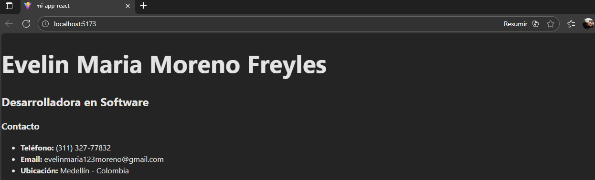
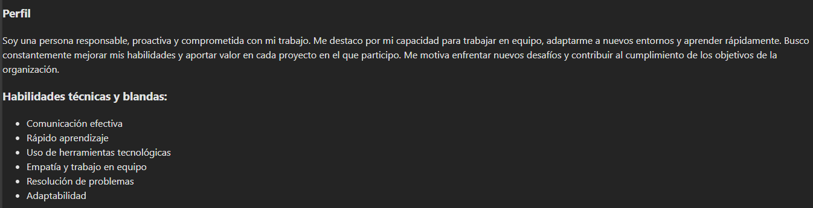
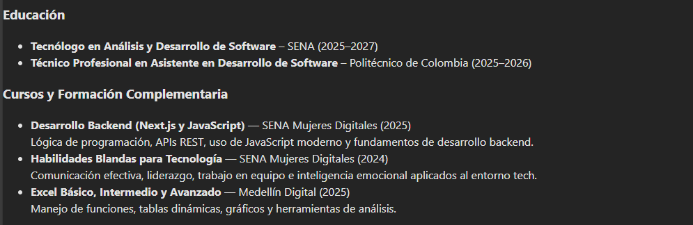
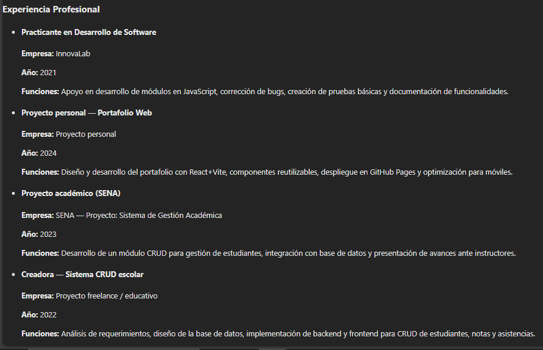

# Mi App React – Hoja de Vida

Este proyecto es una aplicación creada en **React** que muestra una hoja de vida digital con diferentes componentes: Cabecera, Educación, Experiencia, Habilidades y más.

---

# 📸 Capturas de pantalla
A continuación se muestran algunas vistas del proyecto.  

### Vista 1


### Vista 2


### Vista 3


### Vista 4



---

# Instrucciones para ejecutar el proyecto

Sigue estos pasos para ejecutar la aplicación en tu equipo:

# 1. Clonar el repositorio
```bash
git clone https://github.com/EvelinMaria08/React_Angular_SENA.git


# 2. Ingresamos a la carpeta del proyecto React
cd React_Angular_SENA/mi-app-react


# 3. Instalamos las dependencias
Tenemos que Asegúrarnos de tener Node.js instalado.
Luego ejecuta:
    npm install


# 4. Ejecutar el proyecto en modo desarrollo
npm run dev


# 5. Abrir el navegador
Vite te mostrará una URL similar a:
    http://localhost:5173/

---

# Tecnologías usadas

- React
- Vite
- JavaScript
- JSX
- CSS

---

# Autora:
Evelin María Moreno Freyles
Proyecto desarrollado como parte del aprendizaje en React y Angular – SENA